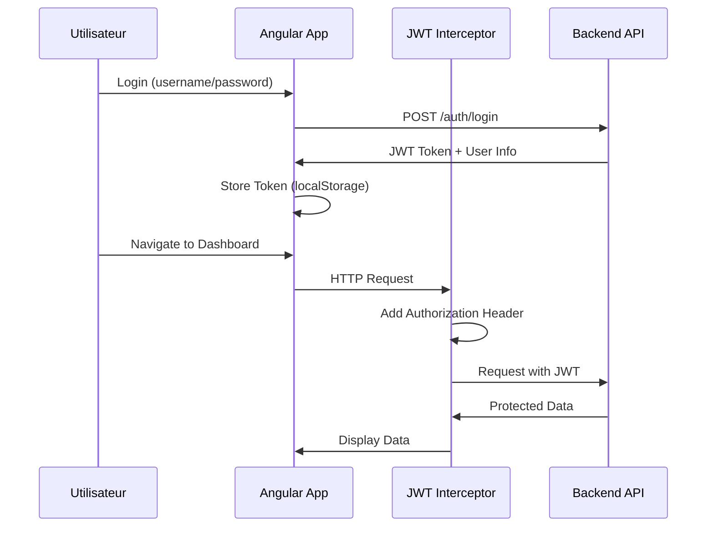
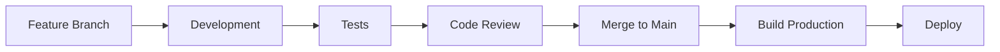

# 📐 Architecture Frontend - Espace Souscripteur

## Vue d'ensemble

Application Angular 18 moderne avec AdminLTE v3, internationalisation complète (FR/EN), et architecture modulaire scalable pour la gestion de la couverture santé.

---

## 🏗️ Architecture Globale

### Stack Technologique

| Technologie | Version | Utilisation |
|-------------|---------|-------------|
| Angular | 18.2.x | Framework frontend |
| TypeScript | 5.5.x | Langage de programmation |
| AdminLTE | 3.2.0 | Template UI/UX |
| Bootstrap | 4.6.2 | Framework CSS |
| Chart.js | 4.4.0 | Visualisation de données |
| ngx-translate | 15.0.0 | Internationalisation |
| RxJS | 7.8.0 | Programmation réactive |
| SweetAlert2 | 11.10.0 | Alertes modernes |

### Architecture en Couches

```
┌─────────────────────────────────────────┐
│         PRÉSENTATION (UI)               │
│  ┌───────────────────────────────────┐  │
│  │  Components & Templates           │  │
│  │  (Angular + AdminLTE)             │  │
│  └───────────────────────────────────┘  │
├─────────────────────────────────────────┤
│         LOGIQUE MÉTIER                  │
│  ┌───────────────────────────────────┐  │
│  │  Services                         │  │
│  │  Guards & Interceptors            │  │
│  │  Validators                       │  │
│  └───────────────────────────────────┘  │
├─────────────────────────────────────────┤
│         COMMUNICATION API               │
│  ┌───────────────────────────────────┐  │
│  │  HTTP Client                      │  │
│  │  JWT Interceptor                  │  │
│  │  Error Handler                    │  │
│  └───────────────────────────────────┘  │
├─────────────────────────────────────────┤
│         DONNÉES & MODÈLES               │
│  ┌───────────────────────────────────┐  │
│  │  TypeScript Interfaces            │  │
│  │  Enums & Types                    │  │
│  └───────────────────────────────────┘  │
└─────────────────────────────────────────┘
```

---

## 📁 Structure Détaillée du Projet

### Core Module (`src/app/core/`)

Le module `core` contient les fonctionnalités essentielles de l'application.

```
core/
├── guards/
│   └── auth.guard.ts                 # Protection des routes
├── interceptors/
│   ├── jwt.interceptor.ts            # Injection automatique JWT
│   └── error.interceptor.ts          # Gestion globale des erreurs
├── models/
│   ├── adherent.model.ts             # Interfaces adhérents
│   ├── prestation.model.ts           # Interfaces prestations
│   ├── dashboard.model.ts            # Interfaces dashboard
│   ├── notification.model.ts         # Interfaces notifications
│   └── auth.model.ts                 # Interfaces authentification
└── services/
    ├── auth.service.ts               # Authentification & sessions
    ├── adherent.service.ts           # Gestion adhérents
    ├── dashboard.service.ts          # Statistiques & KPIs
    ├── report.service.ts             # Génération rapports
    └── notification.service.ts       # Notifications temps réel
```

**Responsabilités:**
- ✅ Services singleton utilisés dans toute l'app
- ✅ Guards de navigation et sécurité
- ✅ Intercepteurs HTTP
- ✅ Modèles de données TypeScript
- ✅ Utilitaires partagés

### Modules Fonctionnels (`src/app/modules/`)

Chaque module représente une fonctionnalité métier distincte.

#### 1. Dashboard Module

```typescript
DashboardModule
├── components/
│   └── dashboard/
│       ├── dashboard.component.ts
│       ├── dashboard.component.html
│       └── dashboard.component.scss
├── services/                         (si spécifique au module)
└── dashboard-routing.module.ts
```

**Fonctionnalités:**
- 📊 Vue d'ensemble de la consommation
- 📈 Graphiques interactifs (Chart.js)
- 🔔 Alertes en temps réel
- 📋 Top prestataires/prestations
- 🔄 Filtres par période

**Widgets AdminLTE utilisés:**
- Small Box (statistiques)
- Card avec Chart.js
- Table pour alertes
- Info Box

#### 2. Adherents Module

```typescript
AdherentsModule
├── components/
│   ├── adherents-list/              # Liste paginée
│   ├── adherent-profile/            # Profil détaillé
│   ├── adherent-form/               # Formulaire CRUD
│   └── ayant-droit-form/            # Gestion ayants droit
├── services/
│   └── adherent-local.service.ts    (si nécessaire)
└── adherents-routing.module.ts
```

**Fonctionnalités:**
- 📋 Liste paginée avec recherche
- 🔍 Filtres avancés (statut, groupe, police)
- 👤 Profil complet avec historique
- 👨‍👩‍👧‍👦 Gestion ayants droit
- 📤 Export PDF/Excel
- 📸 Upload photo

**Composants AdminLTE:**
- DataTable avec pagination
- Profile Widget
- Card avec tabs
- Form controls avancés

#### 3. Reporting Module

```typescript
ReportingModule
├── components/
│   ├── report-generator/            # Générateur de rapports
│   ├── report-list/                 # Liste des rapports
│   ├── report-viewer/               # Visualiseur
│   └── scheduled-reports/           # Rapports programmés
└── reporting-routing.module.ts
```

**Fonctionnalités:**
- 📊 Génération dynamique de rapports
- 🎛️ Filtres multiples configurables
- 📥 Export PDF, Excel, CSV
- ⏰ Programmation automatique
- 📈 Graphiques comparatifs

#### 4. Notifications Module

```typescript
NotificationsModule
├── components/
│   ├── notification-list/           # Liste notifications
│   ├── notification-detail/         # Détail notification
│   └── notification-badge/          # Badge compteur
└── notifications-routing.module.ts
```

**Fonctionnalités:**
- 🔔 Notifications temps réel
- 🔢 Badge de compteur dans navbar
- ✅ Marquage lu/non lu
- 📁 Archivage
- 🏷️ Catégorisation

### Shared Module (`src/app/shared/`)

Composants, directives et pipes réutilisables.

```
shared/
├── components/
│   ├── layout/
│   │   ├── main-layout/             # Layout principal AdminLTE
│   │   ├── header/                  # Navbar
│   │   ├── sidebar/                 # Menu latéral
│   │   └── footer/                  # Pied de page
│   ├── breadcrumb/
│   ├── loading-spinner/
│   ├── confirmation-dialog/
│   └── date-picker/
├── directives/
│   ├── has-permission.directive.ts
│   └── number-only.directive.ts
├── pipes/
│   ├── currency-fcfa.pipe.ts
│   ├── age.pipe.ts
│   └── safe-html.pipe.ts
└── shared.module.ts
```

---

## 🔐 Sécurité et Authentification

### Flow d'Authentification



### Guards de Navigation

```typescript
// Route protégée simple
{
  path: 'dashboard',
  component: DashboardComponent,
  canActivate: [AuthGuard]
}

// Route avec vérification de rôle
{
  path: 'admin',
  canActivate: [AuthGuard],
  data: { roles: ['ADMIN'] }
}

// Route avec permissions
{
  path: 'adherents/edit',
  canActivate: [AuthGuard],
  data: { permissions: ['adherents.update'] }
}
```

### JWT Interceptor

**Fonctionnalités:**
- ✅ Ajout automatique du token JWT aux requêtes
- ✅ Refresh automatique du token
- ✅ Gestion des erreurs 401
- ✅ Redirection vers login si token expiré

---

## 🌍 Internationalisation (i18n)

### Architecture i18n

```
assets/i18n/
├── fr.json                           # Traductions françaises
└── en.json                           # Traductions anglaises
```

### Utilisation dans les templates

```html
<!-- Simple traduction -->
<h1>{{ 'dashboard.title' | translate }}</h1>

<!-- Avec paramètres -->
<p>{{ 'common.welcome_user' | translate:{name: user.nom} }}</p>

<!-- Dans les attributs -->
<input [placeholder]="'common.search' | translate">
```

### Utilisation dans les composants

```typescript
constructor(private translate: TranslateService) {}

changeLanguage(lang: string): void {
  this.translate.use(lang);
  localStorage.setItem('language', lang);
}

getTranslation(key: string): string {
  return this.translate.instant(key);
}
```

### Structure des fichiers de traduction

```json
{
  "common": {
    "save": "Enregistrer",
    "cancel": "Annuler"
  },
  "dashboard": {
    "title": "Tableau de bord",
    "total_consumption": "Consommation totale"
  },
  "adherents": {
    "list": "Liste des adhérents",
    "add": "Ajouter un adhérent"
  }
}
```

---

## 📊 Gestion des Données et État

### Services de Données

Chaque service suit le pattern suivant:

```typescript
@Injectable({ providedIn: 'root' })
export class AdherentService {
  private apiUrl = `${environment.apiUrl}/adherents`;
  
  constructor(private http: HttpClient) {}
  
  // GET - Liste paginée
  getAdherents(page: number, size: number, filters?: any): Observable<PageResponse> {
    let params = new HttpParams()
      .set('page', page.toString())
      .set('size', size.toString());
    
    return this.http.get<PageResponse>(this.apiUrl, { params });
  }
  
  // GET - Par ID
  getAdherent(id: string): Observable<Adherent> {
    return this.http.get<Adherent>(`${this.apiUrl}/${id}`);
  }
  
  // POST - Création
  createAdherent(adherent: Adherent): Observable<Adherent> {
    return this.http.post<Adherent>(this.apiUrl, adherent);
  }
  
  // PUT - Modification
  updateAdherent(id: string, adherent: Adherent): Observable<Adherent> {
    return this.http.put<Adherent>(`${this.apiUrl}/${id}`, adherent);
  }
  
  // DELETE - Suppression
  deleteAdherent(id: string): Observable<void> {
    return this.http.delete<void>(`${this.apiUrl}/${id}`);
  }
}
```

### État Local avec BehaviorSubject

Pour les données partagées entre composants:

```typescript
@Injectable({ providedIn: 'root' })
export class NotificationService {
  private unreadCountSubject = new BehaviorSubject<number>(0);
  public unreadCount$ = this.unreadCountSubject.asObservable();
  
  updateUnreadCount(count: number): void {
    this.unreadCountSubject.next(count);
  }
}
```

---

## 🎨 AdminLTE - Intégration et Personnalisation

### Composants AdminLTE Utilisés

#### 1. Small Box (Dashboard)

```html
<div class="small-box bg-info">
  <div class="inner">
    <h3>{{ totalConsumption | currency }}</h3>
    <p>Consommation Totale</p>
  </div>
  <div class="icon">
    <i class="fas fa-chart-line"></i>
  </div>
  <a href="#" class="small-box-footer">
    Plus d'info <i class="fas fa-arrow-circle-right"></i>
  </a>
</div>
```

#### 2. DataTable avec Pagination

```html
<div class="card">
  <div class="card-header">
    <h3 class="card-title">Liste des adhérents</h3>
  </div>
  <div class="card-body">
    <table class="table table-hover">
      <!-- Contenu table -->
    </table>
  </div>
  <div class="card-footer clearfix">
    <!-- Pagination -->
  </div>
</div>
```

#### 3. Profile Widget

```html
<div class="card card-primary card-outline">
  <div class="card-body box-profile">
    <div class="text-center">
      
    </div>
    <h3 class="profile-username text-center">
      {{ adherent.nom }}
    </h3>
    <p class="text-muted text-center">
      {{ adherent.codeAdherent }}
    </p>
  </div>
</div>
```

### Thèmes et Couleurs

Les couleurs AdminLTE sont personnalisables dans `styles.scss`:

```scss
// Variables AdminLTE
$primary: #007bff;
$success: #28a745;
$warning: #ffc107;
$danger: #dc3545;
$info: #17a2b8;

// Personnalisation du sidebar
.main-sidebar {
  background-color: #343a40;
}

// Personnalisation du navbar
.main-header {
  border-bottom: 1px solid #dee2e6;
}
```

---

## 📈 Performance et Optimisation

### Lazy Loading

Tous les modules sont chargés en lazy loading:

```typescript
{
  path: 'adherents',
  loadChildren: () => import('./modules/adherents/adherents.module')
    .then(m => m.AdherentsModule)
}
```

### OnPush Change Detection

Pour les composants avec beaucoup de données:

```typescript
@Component({
  selector: 'app-adherents-list',
  changeDetection: ChangeDetectionStrategy.OnPush
})
export class AdherentsListComponent {}
```

### Pagination Côté Serveur

```typescript
loadAdherents(page: number, size: number): void {
  this.adherentService.getAdherents(page, size, this.filters)
    .subscribe(response => {
      this.adherents = response.content;
      this.totalElements = response.totalElements;
    });
}
```

### Debounce pour la Recherche

```typescript
searchTerm = '';
searchTimeout: any;

onSearch(): void {
  clearTimeout(this.searchTimeout);
  this.searchTimeout = setTimeout(() => {
    this.loadAdherents();
  }, 500); // 500ms de délai
}
```

---

## 🧪 Tests

### Tests Unitaires

```bash
# Lancer tous les tests
ng test

# Tests avec couverture
ng test --code-coverage

# Test d'un composant spécifique
ng test --include='**/adherent-list.component.spec.ts'
```

### Exemple de Test

```typescript
describe('AdherentListComponent', () => {
  let component: AdherentListComponent;
  let fixture: ComponentFixture<AdherentListComponent>;
  let service: AdherentService;

  beforeEach(async () => {
    await TestBed.configureTestingModule({
      declarations: [ AdherentListComponent ],
      imports: [ HttpClientTestingModule ],
      providers: [ AdherentService ]
    }).compileComponents();
  });

  it('should load adherents on init', () => {
    const mockData = { content: [], totalElements: 0 };
    spyOn(service, 'getAdherents').and.returnValue(of(mockData));
    
    component.ngOnInit();
    
    expect(service.getAdherents).toHaveBeenCalled();
  });
});
```

---

## 🚀 Déploiement

### Build de Production

```bash
# Build optimisé
ng build --configuration production

# Fichiers générés dans dist/
```

### Optimisations Appliquées

- ✅ AOT (Ahead-of-Time) Compilation
- ✅ Tree Shaking
- ✅ Minification
- ✅ Lazy Loading des modules
- ✅ Service Workers (optionnel)

### Configuration Nginx

```nginx
server {
    listen 80;
    server_name espaceclient.com;
    root /var/www/dist;
    index index.html;

    # Redirige tout vers index.html (SPA)
    location / {
        try_files $uri $uri/ /index.html;
    }

    # Cache des assets
    location ~* \.(js|css|png|jpg|jpeg|gif|ico|svg|woff|woff2|ttf)$ {
        expires 1y;
        add_header Cache-Control "public, immutable";
    }

    # Compression gzip
    gzip on;
    gzip_types text/plain text/css application/json application/javascript;
}
```

---

## 📝 Conventions de Développement

### Naming Conventions

- **Components**: `adherent-list.component.ts`
- **Services**: `adherent.service.ts`
- **Models**: `adherent.model.ts`
- **Modules**: `adherents.module.ts`

### Code Style

```typescript
// ✅ BON
export class AdherentListComponent implements OnInit {
  adherents: Adherent[] = [];
  
  loadAdherents(): void {
    // Implementation
  }
}

// ❌ MAUVAIS
export class adherent_list {
  public Adherents = [];
  
  Load_Adherents() {
    // Implementation
  }
}
```

---

## 🔄 Workflow de Développement



---

## 📚 Ressources Complémentaires

- [Angular Documentation](https://angular.io/docs)
- [AdminLTE Documentation](https://adminlte.io/docs/3.0/)
- [TypeScript Handbook](https://www.typescriptlang.org/docs/)
- [RxJS Documentation](https://rxjs.dev/)

---

Cette architecture assure une application **scalable**, **maintenable** et **performante** pour les années à venir. 🚀
